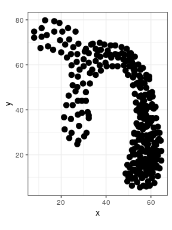
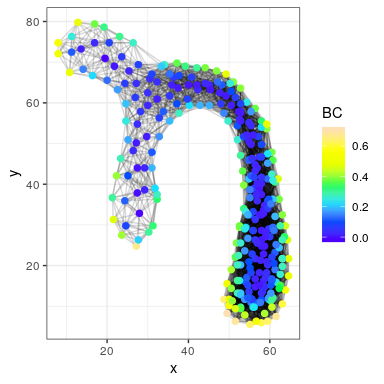
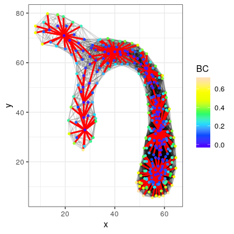
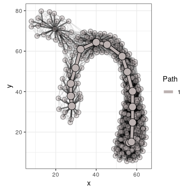
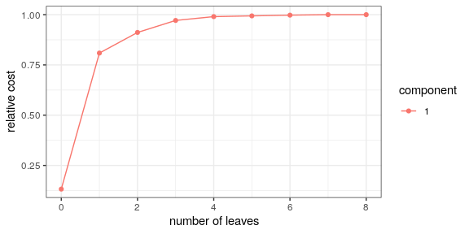
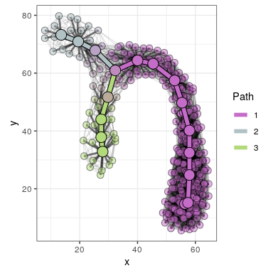
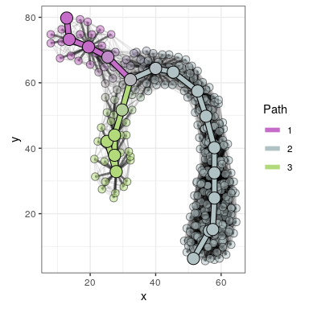

Basic\_Backbone
================
Robin Vandaele

The purpose of this tutorial is to show the basic functionality of the backbone function. We first import the necessary libraries.

``` r
devtools::load_all() # load graphTDA
library("ggplot2") # plotting
```

We load and plot the toy data set that will be used for this example.

``` r
df <- read.table("~/Documents/graphTDA/data/curvY.csv", header=FALSE, sep=",", col.names=c("x", "y"))
ggplot(df, aes(x=x, y=y)) +
  geom_point(size=3) +
  theme_bw() +
  coord_fixed()
```



The most important function for identifying backbones in graphs is, as you might guess, the 'backbone' function. Let's illustrate its functionality by computing a backbone from a (Vietoris-)Rips graph constructed from the point cloud.

``` r
BCB <- backbone(df, # point cloud data.frame/matrix, dist object, or a given graph
                type="rips", # type of proximity graph to construct (standard is knn)
                eps=10, # defining parameter for the rips graph
                assign=TRUE) # whether to assign nodes to branches in the backbone, clarified below
```

    ## [1] "Proximity graph constructed in 0.264 secs"
    ## [1] "Boundary coefficients obtained in 0.911 secs"
    ## [1] "f-pine obtained in 0.005 secs"
    ## [1] "Backbone obtained in 0.037 secs"
    ## [1] "Branch assignment obtained in 0.318 secs"
    ## [1] "--------------------------------------------"
    ## [1] "Backbone pipeline conducted in 1.537 secs"

The constructed proximity graph is stored in the list entry 'G'. As no vertex-valued function was provided to compute the pine, the boundary coefficients were computed and stored in the list entry 'f'. Note the order of the vertices in the constructed graph may differ from the order of points in the data. This needs to be taken into account for visualization (values in f are ordered according to nodes in the graph). We can visualize the graph and boundary coefficients as follows.

``` r
EG <- get_edges2D(df, BCB$G)
ggplot(df[names(V(BCB$G)),], aes(x=x, y=y)) +
  geom_segment(data=EG, aes(x=x1, y=y1, xend=x2, yend=y2), color='black', alpha=0.15) +
  geom_point(size=2, aes(col=BCB$f)) +
  scale_colour_gradientn(colours=topo.colors(7)) +
  labs(col="BC") +
  theme_bw() +
  coord_fixed()
```



The f=BC-pine is constructed as an intermediate representation for topological inference. It is stored in the list entry 'pine', and can be visualized as follows.

``` r
Epine <- get_edges2D(df, BCB$pine)
ggplot(df[names(V(BCB$G)),], aes(x=x, y=y)) +
  geom_segment(data=EG, aes(x = x1, y = y1, xend = x2, yend = y2), color="black", alpha=0.15) +
  geom_segment(data=Epine, aes(x=x1, y=y1, xend=x2, yend=y2), color="red", size=1) +
  geom_point(size=1, aes(col=BCB$f)) +
  scale_colour_gradientn(colours=topo.colors(7)) +
  labs(col="BC") +
  theme_bw() +
  coord_fixed()
```



The inferred backbone is stored in the list entry 'B'. The option 'assign=TRUE' (standard is FALSE) results in an assignment of points to branches of B, i.e., maximal paths without multifurcations. We can visualize the backbone B along with the branch assignment as follows.

``` r
EBCB <- get_edges2D(df, BCB$B)
ggplot(df[names(V(BCB$G)),], aes(x=x, y=y)) +
  geom_segment(data=EG, aes(x=x1, y=y1, xend=x2, yend=y2), color="black", alpha=0.1) +
  geom_segment(data=Epine, aes(x=x1, y=y1, xend=x2, yend=y2), color="black", alpha=0.5, size=1) +
  geom_point(size=3, fill=BCB$col, alpha=0.5, pch=21) +
  geom_segment(data=EBCB, aes(x= x1, y=y1, xend=x2, yend=y2), col="black", size=2.75) +
  geom_segment(data=cbind(EBCB, as.factor(BCB$branch)),
               aes(x=x1, y=y1, xend=x2, yend=y2, col=as.factor(BCB$branch)), size=2) +
  geom_point(data=df[V(BCB$B)$name,], fill=BCB$col[V(BCB$B)$name], size=5, pch=21) +
  scale_color_manual(values=BCB$palette) +
  guides(col = guide_legend(title="Path")) +
  coord_fixed() +
  theme_bw()
```



Since no number of leaves was provided, an 'elbow' estimate was performed on the cost curve obtained by solve CLOF. Although a tree with one leaf is technically not possible, we store the cost of the first 'optimal branch' to track the evolution of the cost. This branch can be identified whenever three leaves are present in the backbone. For 0 leaves, the cost function marks the maximal cost of a node in the graph if CLOF is solved for a vertex-valued function. This is the case here, as the standard setting is to use the betweenness centrality of the pine for solving CLOF. As this function is constant on leaves, the pine is prepruned, significantly decreasing the number of possible leaves for computational efficiency. In this case, the last value of the cost curve will mark the increase that would be achieved when an arbitrary leaf would be added or extended. The relative cost function is stored in the list entry 'cost', and can be visualized as follows. Note that the absolute cost function can be obtained from the relative cost function and the global cost that is stored in the list entry 'full\_cost'.

``` r
ggplot(BCB$cost, aes(x=leaves, y=cost)) +
  geom_line(aes(group=component, col=component)) +
  geom_point(aes(group=component, col=component)) +
  xlab("number of leaves") +
  ylab("relative cost") +
  theme_bw()
```



We see a harsh decrease in the added cost after '1 leaf'. Nevertheless, from visual inspection of the data we note that a backbone with three leaves may be more suitable. We can increase the number of leaves up until the solution obtained from the last CLOF iteration, here 8-1 = 7. Hence, to extract the solution for three leaves (which requires no additional computation), we can proceed as follows.

``` r
BCB <- get_new_leaves(BCB, leaves=3)
EBCB <- get_edges2D(df, BCB$B)
ggplot(df[names(V(BCB$G)),], aes(x=x, y=y)) +
  geom_segment(data=EG, aes(x=x1, y=y1, xend=x2, yend=y2), color="black", alpha=0.1) +
  geom_segment(data=Epine, aes(x=x1, y=y1, xend=x2, yend=y2), color="black", alpha=0.5, size=1) +
  geom_point(size=3, fill=BCB$col, alpha=0.5, pch=21) +
  geom_segment(data=EBCB, aes(x= x1, y=y1, xend=x2, yend=y2), col="black", size=2.75) +
  geom_segment(data=cbind(EBCB, as.factor(BCB$branch)),
               aes(x=x1, y=y1, xend=x2, yend=y2, col=as.factor(BCB$branch)), size=2) +
  geom_point(data=df[V(BCB$B)$name,], fill=BCB$col[V(BCB$B)$name], size=5, pch=21) +
  scale_color_manual(values=BCB$palette) +
  guides(col = guide_legend(title="Path")) +
  coord_fixed() +
  theme_bw()
```



As mentioned, CLOF is standard solved for the betweenness centrality as a vertex-valued cost on the pine. Nevertheless, we can use any nonnegative vertex-valued function for this purpose, such as the vertex degree. Furthermore, since the proximity graph and boundary coefficients were already computed, we can immediately pass them as arguments to avoid unnecessary recomputation. As such, we can conduct the backbone pipeline a second time for a different CLOF optimization function but the same graph/pine as follows.

``` r
CLOF_vcost <- function(G) return(degree(G))
BCB2 <- backbone(BCB$G, f=BCB$f, leaves=3, CLOF_vcost=CLOF_vcost, assign=TRUE)
```

    ## [1] "f-pine obtained in 0.004 secs"
    ## [1] "Backbone obtained in 0.004 secs"
    ## [1] "Branch assignment obtained in 0.3 secs"
    ## [1] "--------------------------------------------"
    ## [1] "Backbone pipeline conducted in 0.509 secs"

``` r
EBCB2 <- get_edges2D(df, BCB2$B)
ggplot(df[names(V(BCB$G)),], aes(x=x, y=y)) +
  geom_segment(data=EG, aes(x=x1, y=y1, xend=x2, yend=y2), color="black", alpha=0.1) +
  geom_segment(data=Epine, aes(x=x1, y=y1, xend=x2, yend=y2), color="black", alpha=0.5, size=1) +
  geom_point(size=3, fill=BCB2$col, alpha=0.5, pch=21) +
  geom_segment(data=EBCB2, aes(x= x1, y=y1, xend=x2, yend=y2), col="black", size=2.75) +
  geom_segment(data=cbind(EBCB2, as.factor(BCB2$branch)),
               aes(x=x1, y=y1, xend=x2, yend=y2, col=as.factor(BCB2$branch)), size=2) +
  geom_point(data=df[V(BCB2$B)$name,], fill=BCB2$col[V(BCB2$B)$name], size=5, pch=21) +
  scale_color_manual(values=BCB2$palette) +
  guides(col = guide_legend(title="Path")) +
  coord_fixed() +
  theme_bw()
```


Note that we now immediately specified that three leaves should be extracted, and no estimate is performed. We can also use an edge-valued function to solve CLOF, such as the edge-weights. However, note that in the weighted case, this function is non-constant on leaves. Hence, no prepruning will be applied, significantly increasing the potential number of leaves and computational cost. To (partially) accomodate for this, we can specify the exact (as above) or a maximal (as follows) allowed number of leaves.

``` r
CLOF_ecost <- function(G) return(E(G)$weight)
BCB3 <- backbone(BCB$G, f=BCB$f, max_leaves=5, CLOF_ecost=CLOF_ecost, assign=TRUE)
```

    ## [1] "f-pine obtained in 0.004 secs"
    ## [1] "Backbone obtained in 0.659 secs"
    ## [1] "Branch assignment obtained in 0.307 secs"
    ## [1] "--------------------------------------------"
    ## [1] "Backbone pipeline conducted in 0.971 secs"

``` r
EBCB3 <- get_edges2D(df, BCB3$B)
ggplot(df[names(V(BCB$G)),], aes(x=x, y=y)) +
  geom_segment(data=EG, aes(x=x1, y=y1, xend=x2, yend=y2), color="black", alpha=0.1) +
  geom_segment(data=Epine, aes(x=x1, y=y1, xend=x2, yend=y2), color="black", alpha=0.5, size=1) +
  geom_point(size=3, fill=BCB3$col, alpha=0.5, pch=21) +
  geom_segment(data=EBCB3, aes(x= x1, y=y1, xend=x2, yend=y2), col="black", size=2.75) +
  geom_segment(data=cbind(EBCB3, as.factor(BCB3$branch)),
               aes(x=x1, y=y1, xend=x2, yend=y2, col=as.factor(BCB3$branch)), size=2) +
  geom_point(data=df[V(BCB3$B)$name,], fill=BCB3$col[V(BCB3$B)$name], size=5, pch=21) +
  scale_color_manual(values=BCB3$palette) +
  guides(col = guide_legend(title="Path")) +
  coord_fixed() +
  theme_bw()
```



The specified max number of leaves (5) was below the total number of leaves (7) in the prepruned pine above. Nevertheless, we still observe that it still takes relatively much longer to obtain the backbone. This is because solving CLOF starts by computing the distance of all nodes in the pine to all leaves in the pine. Both these numbers tend do decrease drastically when prepruning the pine, showing the usefulness of functions constant on leaves in conjunnction with CLOF. Furthermore, as no exact number of leaves was specified, we see that this time the elbow estimate does lead to three leaves. However, we observe that these are chosen rather randomly among the noise, again showing the usefulness of prepruning the pine. Finally, now that we have three differently obtained backbones, we can evaluate and compare them as follows.

``` r
backbones_evaluate(list(BCB, BCB2, BCB3))
```

    ## [1] "Computing longest path in original graph..."
    ## [1] "Computing center(s) and total variance in original graph..."
    ## [1] "Computing average commute times in original graph..."
    ## [1] "Computing projection on backbone 1..."
    ## [1] "Computing R: goodness of fit of backbone 1..."
    ## [1] "Computing sigma: smoothness of backbone 1..."
    ## [1] "Computing cor_act: correlation to average commute times of projection on backbone 1..."
    ## [1] "Computing projection on backbone 2..."
    ## [1] "Computing R: goodness of fit of backbone 2..."
    ## [1] "Computing sigma: smoothness of backbone 2..."
    ## [1] "Computing cor_act: correlation to average commute times of projection on backbone 2..."
    ## [1] "Computing projection on backbone 3..."
    ## [1] "Computing R: goodness of fit of backbone 3..."
    ## [1] "Computing sigma: smoothness of backbone 3..."
    ## [1] "Computing cor_act: correlation to average commute times of projection on backbone 3..."

    ##       frac_V      frac_E         R     sigma   cor_act leaves
    ## 1 0.05666667 0.002261804 0.8514627 0.8716234 0.3069954      3
    ## 2 0.05666667 0.002261804 0.8514627 0.8716234 0.3069954      3
    ## 3 0.06666667 0.002685892 0.8598195 0.8411871 0.3119983      3
