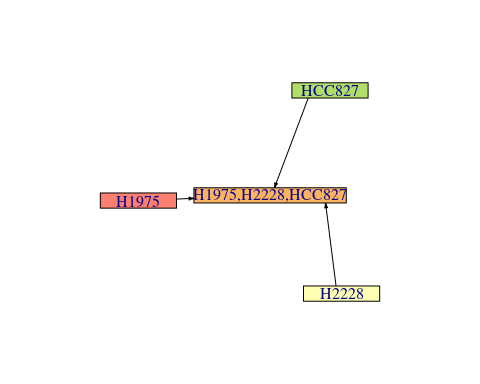
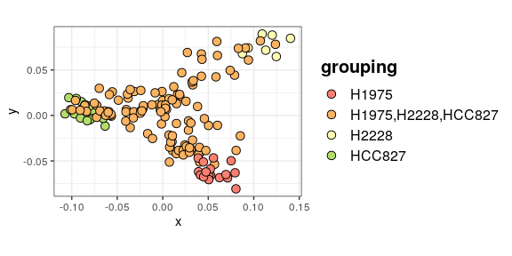
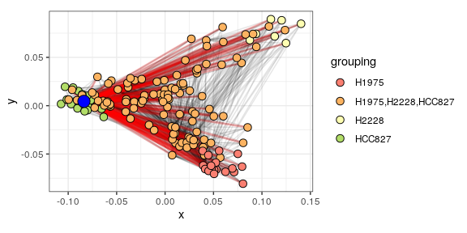
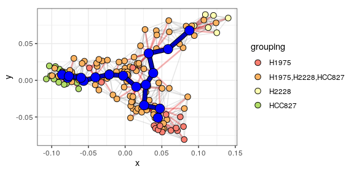

Cell\_Trajectory\_Inference
================
Robin Vandaele

The purpose of this tutorial is to show how to infer backbones in real-world cell trajectory data. We recommend to go through the 'Basic\_Backbone' tutorial first. We start by importing the necessary libraries.

``` r
devtools::load_all() # load graphTDA
library("ggplot2") # plotting
library("dyndimred") # dimensionality reductions for cell trajectory data
```

The data we use is obtained from <https://zenodo.org/record/1443566>. It is in an R data format 'rds'. It can be read as follows.

``` r
cells_info <- readRDS("~/Documents/graphTDA/data/Cells")
names(cells_info)
```

    ##  [1] "id"                    "cell_ids"              "cell_info"            
    ##  [4] "source"                "normalisation_info"    "creation_date"        
    ##  [7] "group_ids"             "grouping"              "milestone_ids"        
    ## [10] "milestone_network"     "divergence_regions"    "milestone_percentages"
    ## [13] "progressions"          "trajectory_type"       "directed"             
    ## [16] "counts"                "expression"            "feature_info"         
    ## [19] "prior_information"     "waypoint_cells"        "root_milestone_id"

We see that the data contains a lot of information about the cells, much of which we will not be using. The important objects for us are the expression data, the model, and the cell grouping. We can visualize the underlying graph model on the cell groupings as follows.

``` r
G <- graph_from_data_frame(cells_info$milestone_network)
names(V(G))
```

    ## [1] "H1975"              "HCC827"             "H2228"             
    ## [4] "H1975,H2228,HCC827"

``` r
cols <- c("H1975"=rgb(250, 127, 113, maxColorValue = 255),
          "HCC827"=rgb(178, 221, 104, maxColorValue = 255),
          "H2228"=rgb(254, 254, 178, maxColorValue = 255),
          "H1975,H2228,HCC827"=rgb(252, 179, 97, maxColorValue = 255))
V(G)$color <- cols
set.seed(42)
op <- par(mar = c(0, 0, 0, 0))
plot(G, vertex.shape="rectangle", vertex.label.cex=1, vertex.size=c(75, 75, 75, 150),
     edge.arrow.size=0.25, edge.color="black"); par(op)
```



The expression data can be extracted as follows.

``` r
dim(cells_info$expression)
```

    ## [1]  154 1770

We see that the data is high(1770)-dimensional. We can hence not straightforwardly visualize the data without a dimensionality reduction. For this, we will use a diffusion embedding on three components, and use the first two for visualization.

``` r
fit <- data.frame(dimred(cells_info$expression, method="dm_diffusionmap", ndim=3))
```

    ## Performing eigendecomposition
    ## Computing Diffusion Coordinates
    ## Elapsed time: 0.037 seconds

``` r
colnames(fit)[1:2] <- c("x", "y")
```

We can now visualize the data along with the cell groupings as follows.

``` r
grouping <- factor(cells_info$grouping)
ggplot(fit, aes(x=x, y=y, fill=grouping)) +
  geom_point(size=3, col="black", pch=21) +
  scale_colour_manual(values=cols, aesthetics="fill") +
  coord_fixed() +
  theme_bw() +
  theme(legend.title=element_text(size=15, face="bold"), legend.text=element_text(size=12))
```



We will first attempt to recover the backbone from the original high-dimensional data. Using the standard settings, a 10NN graph will be constructed from this data first.

``` r
BCB <- backbone(cells_info$expression)
```

    ## [1] "Proximity graph constructed in 0.059 secs"
    ## [1] "Boundary coefficients obtained in 0.102 secs"
    ## [1] "f-pine obtained in 0.001 secs"
    ## [1] "Backbone obtained in 0.012 secs"
    ## [1] "--------------------------------------------"
    ## [1] "Backbone pipeline conducted in 0.175 secs"

We can view the 10NN graph, BC-pine, and inferred model as follows. Again, we use the first two diffusion coordinates for visualization.

``` r
EG <- get_edges2D(fit[,1:2], BCB$G)
Epine <- get_edges2D(fit[,1:2], BCB$pine)
ggplot(fit[V(BCB$G)$name,], aes(x=x, y=y)) +
  geom_segment(data=EG, aes(x=x1, y=y1, xend=x2, yend=y2), color="black", alpha=0.1) +
  geom_segment(data=Epine, aes(x=x1, y=y1, xend=x2, yend=y2), color="red", alpha=.25, size=1) +
  geom_point(size=3, aes(fill=grouping), pch=21) +
  geom_point(data=fit[V(BCB$B)$name,], fill="blue", size=5, pch=21) +
  scale_colour_manual(values=cols, aesthetics="fill") +
  coord_fixed() +
  theme_bw()
```



We observe that the backbone consists only of one point, as the BC-pine connects everything to it. This is because the quality of the kNN graph is highly affected by the curse of dimensionality. In high-dimensional data, Euclidean distances inefficiently discriminate between nearest neighbors. Note that our backbone models the constructed proximity graph, rather than the original data. Hence, to correctly model our original data, it is important that the proximity graph correctly models the data. For this reason, we commonly start by an initial dimensionality reduction, prior to constructing the proximity graph. We will proceed with the 3-dimensional diffusion map embedding for this purpose.

``` r
BCB <- backbone(fit)
```

    ## [1] "Proximity graph constructed in 0.037 secs"
    ## [1] "Boundary coefficients obtained in 0.071 secs"
    ## [1] "f-pine obtained in 0.001 secs"
    ## [1] "Backbone obtained in 0.295 secs"
    ## [1] "--------------------------------------------"
    ## [1] "Backbone pipeline conducted in 0.405 secs"

Again, we use the first two diffusion coordinates for visualization. Note that now both the proximity graph and pine have changed as well, so we need to recompute their edges.

``` r
EG <- get_edges2D(fit[,1:2], BCB$G)
Epine <- get_edges2D(fit[,1:2], BCB$pine)
EBCB <- get_edges2D(fit[,1:2], BCB$B)
ggplot(fit[V(BCB$G)$name,], aes(x=x, y=y)) +
  geom_segment(data=EG, aes(x=x1, y=y1, xend=x2, yend=y2), color="black", alpha=0.1) +
  geom_segment(data=Epine, aes(x=x1, y=y1, xend=x2, yend=y2), color="red", alpha=.25, size=1) +
  geom_point(size=3, aes(fill=grouping), pch=21) +
  geom_segment(data=EBCB, aes(x= x1, y=y1, xend=x2, yend=y2), col="black", size=2.75) +
  geom_segment(data=EBCB, aes(x=x1, y=y1, xend=x2, yend=y2), col="blue", size=2, alpha=0.75) +
  geom_point(data=fit[V(BCB$B)$name,], fill="blue", size=5, pch=21) +
  scale_colour_manual(values=cols, aesthetics="fill") +
  coord_fixed() +
  theme_bw()
```



We see that all three of the kNN graph, BC-pine, and backbone, are now much more representative for the ground-truth model. Furthermore, as this number was not specified, the elbow estimator correctly inferred three leaves.
