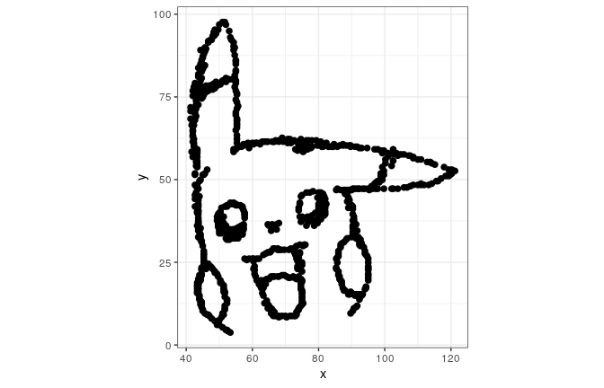
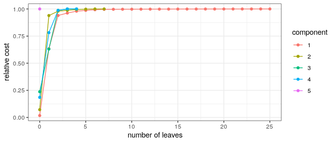
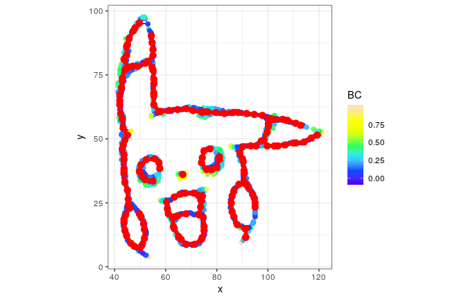
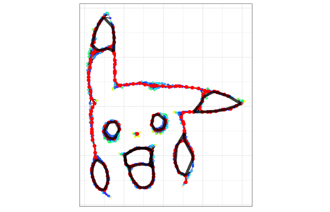

Disconnected\_with\_Cycles
================
Robin Vandaele

The purpose of this tutorial is to show how to infer backbones in disconnected graphs, and how to identify 'gaps' in the backbone. We recommend to go through the 'Basic\_Backbone' and 'Persistence' tutorials first. We start by importing the necessary libraries.

``` r
devtools::load_all() # load graphTDA
library("ggplot2") # plotting
```

We load and plot the toy data set that will be used for this example. It corresponds to our beloved friend Pikachu (please be kind, it took me quite some attempts to 'draw' this data set).

``` r
df <- read.table("~/Documents/graphTDA/data/Pikachu.csv", header=FALSE, sep=",")
colnames(df) <- c("x", "y")
ggplot(df, aes(x=x, y=y)) +
  geom_point(size=2) +
  theme_bw() +
  coord_fixed()
```



As in the 'Basic\_Backbone' tutorial, we can easily conduct the complete backbone pipeline as follows.

``` r
BCB <- backbone(df, type="rips", eps=3.5)
```

    ## [1] "Proximity graph constructed in 0.709 secs"
    ## [1] "Boundary coefficients obtained in 1.094 secs"
    ## [1] "f-pine obtained in 0.004 secs"
    ## [1] "Backbone obtained in 0.418 secs"
    ## [1] "--------------------------------------------"
    ## [1] "Backbone pipeline conducted in 2.227 secs"

We can visualize the graph, boundary coefficients, pine, and backbone, as follows.

``` r
EG <- get_edges2D(df, BCB$G)
Epine <- get_edges2D(df, BCB$pine)
EBCB <- get_edges2D(df, BCB$B)
ggplot(df[names(V(BCB$G)),], aes(x=x, y=y)) +
  geom_segment(data=EG, aes(x=x1, y=y1, xend=x2, yend=y2), color='black', alpha=0.15) +
  geom_segment(data=Epine, aes(x=x1, y=y1, xend=x2, yend=y2), color='black') +
  geom_point(size=2, aes(col=BCB$f)) +
  geom_point(data=df[V(BCB$B)$name,], size=3, col="red") +
  geom_segment(data=EBCB, aes(x=x1, y=y1, xend=x2, yend=y2), color='red', size=2) +
  scale_colour_gradientn(colours=topo.colors(7)) +
  labs(col="BC") +
  theme_bw() +
  coord_fixed()
```


Note that there are multiple connected components in the constructed graph, and hence, in the backbone. We can identify which nodes belong to which connected components through the list entry 'membership'.

``` r
BCB$membership[1:10]
```

    ##  1  2  3  4  5  6  7  8  9 10 
    ##  1  2  1  2  3  1  2  1  1  2

Cost curves for CLOF are now identified per connected component. We can visualize these as follows.

``` r
ggplot(BCB$cost, aes(x=leaves, y=cost)) +
  geom_line(aes(group=component, col=component)) +
  geom_point(aes(group=component, col=component)) +
  xlab("number of leaves") +
  ylab("relative cost") +
  theme_bw()
```



Again, we visually observe that Pikachu's backbone might be improved by adding additional leaves. For multiple components, we can proceed in various ways. The first is to specify the total number of leaves for solving CLOF, summed over all components. Using the 'get\_new\_leaves' function, CLOF will not be needed to resolved for this. Hower this does require some additional optimization over the stored solutions per component. A dominant term in the order of computational time for this is l^B0, where l is the number of leaves in the pine and B0 is the number of connected components. Although exponential in the number of connected components, we observe that the additional computation cost is often neglible in practice when prepruning the pine, as then both l and B0 tend to be small. We proceed as follows.

``` r
BCB <- get_new_leaves(BCB, leaves=16)
EBCB <- get_edges2D(df, BCB$B)
ggplot(df[names(V(BCB$G)),], aes(x=x, y=y)) +
  geom_segment(data=EG, aes(x=x1, y=y1, xend=x2, yend=y2), color='black', alpha=0.15) +
  geom_segment(data=Epine, aes(x=x1, y=y1, xend=x2, yend=y2), color='black') +
  geom_point(size=2, aes(col=BCB$f)) +
  geom_point(data=df[V(BCB$B)$name,], size=3, col="red") +
  geom_segment(data=EBCB, aes(x=x1, y=y1, xend=x2, yend=y2), color='red', size=2) +
  scale_colour_gradientn(colours=topo.colors(7)) +
  labs(col="BC") +
  theme_bw() +
  coord_fixed()
```


We observe that the backbone extends much better around the contour of Pikachu's face. Still, Pikachu's mouth is left untouched, and he might not be able to smell those taste pecha berries any longer. This is because the betweenness centrality is significantly higher in larger connected components. For this reason, global optimization (over the components) will be biased towards larger components. We can overcome this by standardizing the function for solving CLOF per component. Again, this requires the additional optimization as above, which can be done as follows.

``` r
BCB <- get_new_leaves(BCB, leaves=16, stdize=TRUE)
EBCB <- get_edges2D(df, BCB$B)
ggplot(df[names(V(BCB$G)),], aes(x=x, y=y)) +
  geom_segment(data=EG, aes(x=x1, y=y1, xend=x2, yend=y2), color='black', alpha=0.15) +
  geom_segment(data=Epine, aes(x=x1, y=y1, xend=x2, yend=y2), color='black') +
  geom_point(size=2, aes(col=BCB$f)) +
  geom_point(data=df[V(BCB$B)$name,], size=3, col="red") +
  geom_segment(data=EBCB, aes(x=x1, y=y1, xend=x2, yend=y2), color='red', size=2) +
  scale_colour_gradientn(colours=topo.colors(7)) +
  labs(col="BC") +
  theme_bw() +
  coord_fixed()
```


Aha! Pikachu can smell those lovely berries yet again. Note that by convention we regard isolated nodes as trees with one leaf, to distinguish between empty graphs as trees with no leaves. Still, we see that there are insufficient leaves to fill one of Pikachu's ears and cheeks. Instead of fiddling around with a global number of leaves, we can directly specify the number of leaves per component. This time no additional optimization will be required, as all solutions of CLOF for different number of leaves are stored per component. Note that the order of the specified leaves must be consistent with the order of connected components in the 'membership' entry above. Hence, we proceed as as follows.

``` r
BCB <- get_new_leaves(BCB, leaves=c(7, 4, 2, 2, 1))
EBCB <- get_edges2D(df, BCB$B)
ggplot(df[names(V(BCB$G)),], aes(x=x, y=y)) +
  geom_segment(data=EG, aes(x=x1, y=y1, xend=x2, yend=y2), color='black', alpha=0.15) +
  geom_segment(data=Epine, aes(x=x1, y=y1, xend=x2, yend=y2), color='black') +
  geom_point(size=2, aes(col=BCB$f)) +
  geom_point(data=df[V(BCB$B)$name,], size=3, col='red') +
  geom_segment(data=EBCB, aes(x=x1, y=y1, xend=x2, yend=y2), color='red', size=2) +
  scale_colour_gradientn(colours=topo.colors(7)) +
  labs(col="BC") +
  theme_bw() +
  coord_fixed()
```



Now ain't that a beautiful fellow! Apart from one thing... There are still some gaps in Pikachu's mouth, cheeks, ears, and eyes. As our method is designed to infer forest-structured backbones, it is uncabable of directly including cycles. However, persistent homology through the distances defined by the original graph, restricted to the backbone, allows one to identify these gaps. The following function adds an additional list entry 'diagram' to our object for visualizing this persistence diagram.

``` r
BCB <- check_for_cycles(BCB)
```

    ## [1] "Persistent homology computation performed in 3.766 secs"

``` r
op <- par(mar = c(3.25, 3.25, 1, 1))
plot.diagram(BCB$diagram, diagLim=c(0, 20))
legend(17.5, 5, legend=c("H0", "H1"), col=c("black", "red"), 
       pch=c(19, 2), pt.lwd=2, box.lty=0); par(op)
```


The persistence diagram shows 8 'persisting' cycles (red H1 triangles). This is consistent with the 8 missing gaps: 2 for Pikachu's mouth, 2 for his cheeks, 2 for his ears, and 2 for his eyes. Furthermore, the previous function also added an additional list entry 'repCycles'. Through this, we can mark and visualize the corresponding cycles as follows.

``` r
Ecocycles <- do.call("rbind", BCB$repCycles)
Ecocycles <- cbind(df[Ecocycles[,1],], df[Ecocycles[,2],])
colnames(Ecocycles) <- c("x1", "y1", "x2", "y2")

ggplot(df[names(V(BCB$G)),], aes(x=x, y=y)) +
  geom_segment(data=EG, aes(x=x1, y=y1, xend=x2, yend=y2), color='black', alpha=0.15) +
  geom_segment(data=Epine, aes(x=x1, y=y1, xend=x2, yend=y2), color='black') +
  geom_point(size=1, aes(col=BCB$f)) +
  geom_point(data=df[V(BCB$B)$name,], size=2, col='red') +
  geom_segment(data=EBCB, aes(x=x1, y=y1, xend=x2, yend=y2), color='red', size=1) +
  geom_segment(data=Ecocycles, aes(x=x1, y=y1, xend=x2, yend=y2), color='black', size=2, alpha=0.75) +
  scale_colour_gradientn(colours=topo.colors(7)) +
  labs(col="BC") +
  coord_fixed() +
  theme_bw() +
  theme(text = element_text(size=20),
        legend.position="none",
        axis.title.x=element_blank(),
        axis.text.x=element_blank(),
        axis.ticks.x=element_blank(),
        axis.title.y=element_blank(),
        axis.text.y=element_blank(),
        axis.ticks.y=element_blank())
```



Note that the 'representative cycles' are not necessarily subgraphs of the original graph. Hence how to effectively lift/add these to the backbone is open to further research. Furthermore, the current used R implementation of persistent homology tends to lead to memory issues quickly. We therefore suggest future incorporation of more efficient implementations to accomodate for this.
