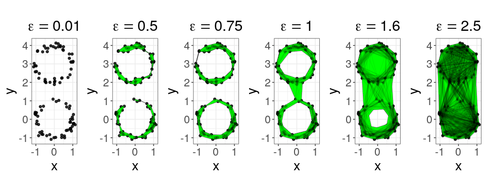

Persistence
================
Robin Vandaele

The purpose of this tutorial is to introduce persistent homology in R. The code can also be easily adapted to explain the method through custom point cloud data with accompanied filtration visualization, e.g., for in academic papers (something I found lacking myself). We first import the necessary libraries.

``` r
devtools::load_all() # load graphTDA (only the 'TDA' library needed here)
library("ggplot2") # plotting
library("latex2exp") # LaTeX text in figures
library("gridExtra") # arrange multiple plots
```

We sample and plot a point cloud data set, of which the underlying topological model equals two disconnected cycles.

``` r
set.seed(42)
n <- 50 # points per circle
theta <- runif(2 * n, 0, 2 * pi)
ycenters <- c(0, 3)
df <- data.frame(x=cos(theta) + rnorm(2 * n, sd=0.1), 
                 y=rep(ycenters, each=n) + sin(theta) + rnorm(2 * n, sd=0.1))
ggplot(df, aes(x=x, y=y)) +
  geom_point(size=1) +
  coord_fixed() +
  theme_bw()
```


For each time/distance parameter epsilon, we construct a simplicial complex for each subset of points with diameter at most epsilon. Varying epsilon, this then results in a (Viertoris-Rips) filtration, i.e., a sequence of changing simplicial complexes ordered by inclusion. As the original data is two-dimensional, only zero-dimensional (connected components) and one-dimensional (cycles) holes can (dis)appear in this filtration. Before illustrating this filtration, we first construct it at follows.

``` r
filtration <- ripsFiltration(df, maxdimension=1, maxscale=Inf)
```

To illustrate this filtration, we visualize the simplicial complexes for a few (increasing) time/distance parameters epsilon.

``` r
epsilons <- c(0.01, 0.5, 0.75, 1, 1.6, 2.5) # time parameters to show the simplicial complex

simpPlots <- list()
for(idx in 1:length(epsilons)){
  print(paste("Constructing plot for time parameter epsilon =", epsilons[idx]))

  # Initialize the complex
  if(idx == 1){
    edges <- data.frame(x1=numeric(0), y1=numeric(0), x2=numeric(0), y2=numeric(0))
    triangles  <- data.frame(id=integer(0), x=numeric(0), y=numeric(0))
  }

  # Determine new simplices for this complex
  this_simplices_I <- which(filtration$values <= epsilons[idx] & 
                              filtration$values > max(epsilons[idx - 1], 0))

  # Determine new edges for this complex
  this_edges_I <- which(sapply(filtration$cmplx[this_simplices_I], function(s) length(s) == 2))
  this_edges <- matrix(do.call("rbind", filtration$cmplx[this_simplices_I[this_edges_I]]), ncol=2)
  this_edges <- data.frame(cbind(df[this_edges[,1],], df[this_edges[,2],]))
  colnames(this_edges) <- c("x1", "y1", "x2", "y2")

  # Determine new triangles for this complex
  this_triangles_I <- which(sapply(filtration$cmplx[this_simplices_I], function(s) length(s) == 3))
  this_triangles_vertex_I <- unlist(filtration$cmplx[this_simplices_I[this_triangles_I]])
  if(length(this_triangles_I) > 0){
    new_triangles_grouping <- rep((nrow(triangles) / 3 + 1):
                                    (nrow(triangles) / 3 + length(this_triangles_I)), each=3)
  }
  else new_triangles_grouping <- integer()

  # Add new edges and triangles to the visualization
  edges <- rbind(edges, this_edges)
  triangles <- rbind(triangles, cbind(id=new_triangles_grouping, df[this_triangles_vertex_I,]))

  # Plot the simplicial complex
  simpPlots[[length(simpPlots) + 1]] <- ggplot(df, aes(x=x, y=y)) +
    geom_segment(data=edges, aes(x=x1, y=y1, xend=x2, yend=y2), color="black", size=0.5, alpha=0.5) +
    geom_point(size=1.5, alpha=0.75) +
    geom_polygon(data=triangles, aes(group=id), fill="green") +
    geom_segment(data=edges, aes(x=x1, y=y1, xend=x2, yend=y2), color="black", size=0.5, alpha=0.05) +
    geom_point(size=1.5, alpha=0.25) +
    coord_fixed() +
    theme_bw() +
    ggtitle(TeX(sprintf("$\\epsilon = %g$", epsilons[idx]))) +
    scale_x_continuous(breaks = c(-1, 0, 1)) +
    theme(plot.title = element_text(hjust = 0.5, size=22), text = element_text(size=20))
}
```

    ## [1] "Constructing plot for time parameter epsilon = 0.01"
    ## [1] "Constructing plot for time parameter epsilon = 0.5"
    ## [1] "Constructing plot for time parameter epsilon = 0.75"
    ## [1] "Constructing plot for time parameter epsilon = 1"
    ## [1] "Constructing plot for time parameter epsilon = 1.6"
    ## [1] "Constructing plot for time parameter epsilon = 2.5"

``` r
grid.arrange(grobs=simpPlots, ncol=length(epsilons))
```



We see that various connected components (0-dim. holes) and cycles (1-dim. holes) appear and disappear across this filtration. The idea is that holes that persist for longer correspond to siginificant features of the underlying topological model. We can compute the persistence of these features as follows.

``` r
diag <- filtrationDiag(filtration, maxdimension=1)
```

We can visualize the results of persistent homology in two ways. The first is by means of persistence barcodes, where a bar from b to d represent a topological feature that persists from time b to d.

``` r
op <- par(mar = c(3.25, 1, 1, 1))
plot.diagram(diag[["diagram"]], diagLim=c(0,  2.5), barcode=TRUE)
legend(2, 100, legend=c("H0", "H1"), col=c("black", "red"), lty=1, lwd=2, box.lty=0); par(op)
```


The second is by means of persistence diagrams, where a point (b, d) represent a topological feature that persists from time b to d.

``` r
op <- par(mar = c(3.25, 3.25, 1, 1))
plot.diagram(diag[["diagram"]], diagLim=c(0, 2.5))
legend(2, 1, legend=c("H0", "H1"), col=c("black", "red"), pch=c(19, 2), pt.lwd=2, box.lty=0); par(op)
```


In both cases, we see that two holes tend to persist in both dimensions. This corresponds to the two connected components (H0) and two cycles (H1) in our underlying topological model. In the barcodes plot, this correspond to bars much longer than the others. In the diagrams plot, this correspond to points elevated higher than the others. Note that for the used type of filtration, there will always be one connected component with 'infinite persistence'. This is because at some time, all points must be and remain connected in the filtration. E.g., for this reason the longest bar for connected components appears to be much longer than the second longest.
