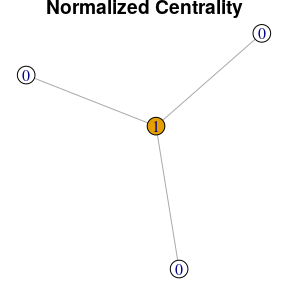
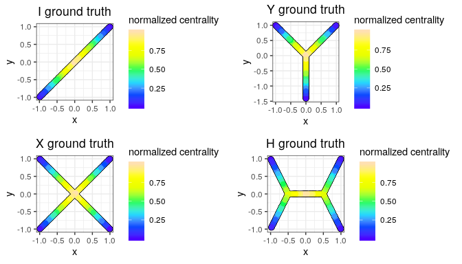
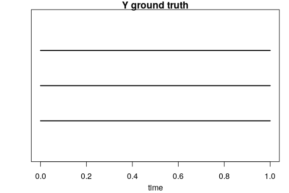
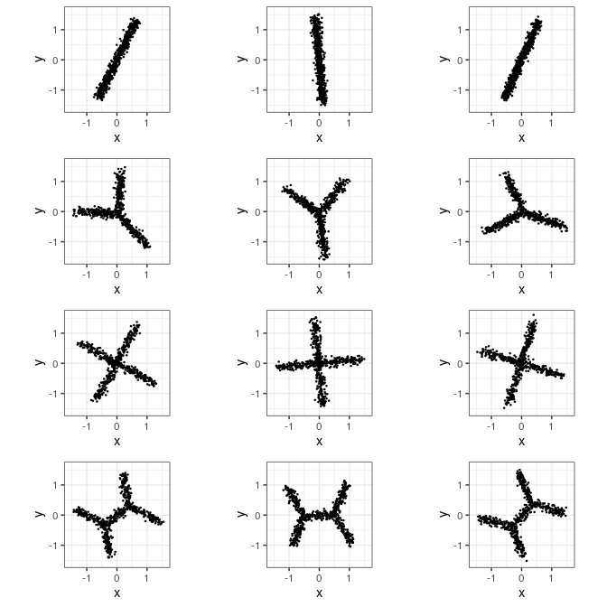
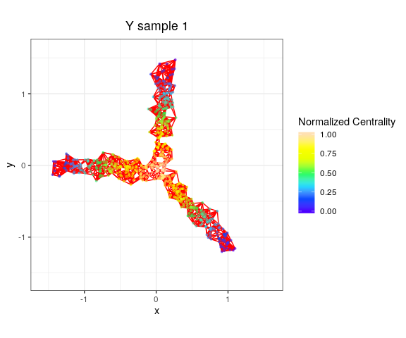
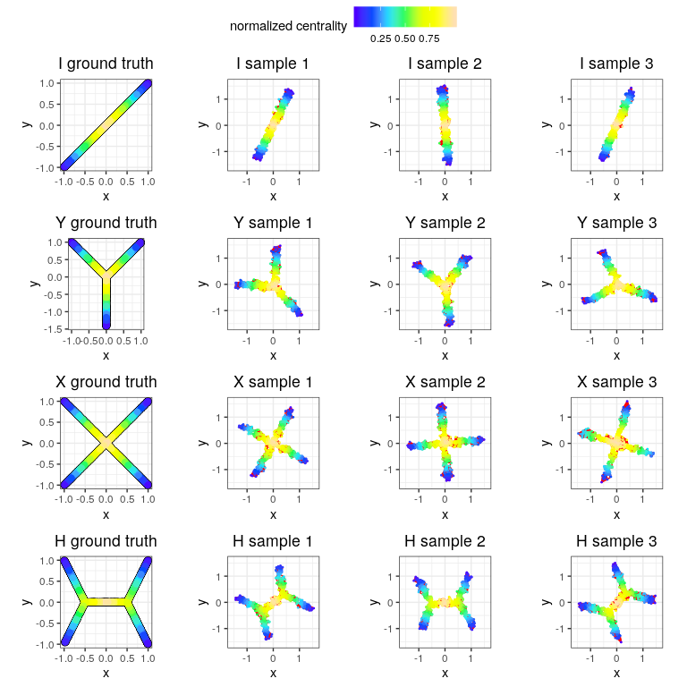
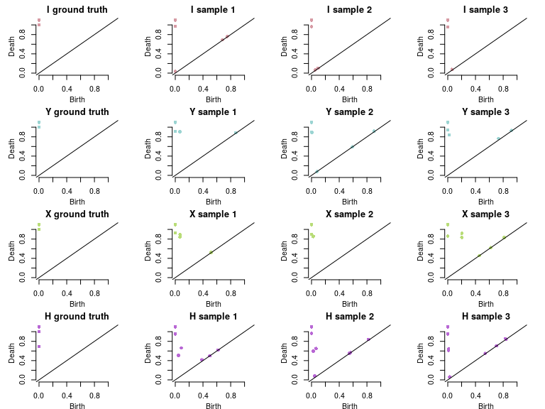
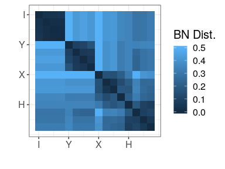
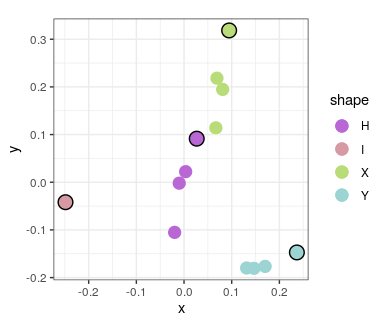

Topological\_Signatures
================
Robin Vandaele

The purpose of this tutorial is to show how we can compute and compare topological signatures of graphs in R. This is mostly performed through the 'TDA' library. However, we provide the functionality to modify igraph objects to be compatible with this library. We first import the necessary libraries.

``` r
devtools::load_all() # load graphTDA
library("ggplot2") # plotting
library("ggpubr") # plotting in grid
```

We define a list of shapes, that will make up the underlying models of the point cloud data sets we will compare. These shapes will be metric trees, defined by a collection of segments between start and end points.

``` r
Ishape <- list(list(start=c(-1, -1), end=c(0, 0)),
               list(start=c(0, 0), end=c(1,  1)))

Yshape <- list(list(start=c(0, 0), end=c(1, 1)),
               list(start=c(0, 0), end=c(-1, 1)),
               list(start=c(0, 0), end=c(0, -sqrt(2))))

Xshape <- list(list(start=c(0, 0), end=c(1, 1)),
               list(start=c(0, 0), end=c(-1, 1)),
               list(start=c(0, 0), end=c(1, -1)),
               list(start=c(0, 0), end=c(-1, -1)))

Hshape <- list(list(start=c(-1/2, 0), end=c(0, 0)),
               list(start=c(1/2, 0), end=c(0, 0)),
               list(start=c(-1/2, 0), end=c(-1, 1)),
               list(start=c(-1/2, 0), end=c(-1, -1)),
               list(start=c(1/2, 0), end=c(1, 1)),
               list(start=c(1/2, 0), end=c(1, -1)))

shapes <- list("I"=Ishape, "Y"=Yshape, "X"=Xshape, "H"=Hshape)
```

By connecting the points defined above by continuous line segments, we obtain our continuous topological models. However, all topological information, such as leaves and multifurcations, of these continuous models coincides with the analogs in their discrete graph counterparts. Instead of connecting the points by a continuous segment in the plane, these graph counterparts are obtained by connecting them by an edge. Furthermore, we will obtain the true topological signatures from the models through the normalized centralities of these graphs. For a given graph, these can be obtained by the 'normalized\_centrality' function. We construct these discrete graph representations and their normalized centralities below.

``` r
trueGraphs <- lapply(shapes, function(shape){
  # Construct discrete graph representation of the continuous model
  G <- t(sapply(shape, function(shape) do.call("c", shape)))
  weight <- apply(G, 1, function(r) norm(r[1:2] - r[3:4], type="2"))
  G <- graph_from_data_frame(
    data.frame(from=(apply(matrix(G[,1:2], ncol=2), 1, function(r) paste(r[1], r[2]))),
               to=apply(matrix(G[,3:4], ncol=2), 1, function(r) paste(r[1], r[2]))),
    directed=FALSE)
  E(G)$weight <- weight

  # Compute normalized vertex centralities
  G$NC <- normalized_centrality(G)
  return(G)
})
```

We can now look at a discrete graph representation and its normalized centralities for an example model. Note that the following layout does not make use of the endpoints in the Euclidean plane defined above.

``` r
example_shape <- "Y"
set.seed(42)
op <- par(mar = c(0, 0, 0.75, 0))
plot(trueGraphs[[example_shape]], vertex.label=trueGraphs[[example_shape]]$NC,
     vertex.color=trueGraphs[[example_shape]]$NC, main="Normalized Centrality"); par(op)
```



From these graphs we will compute the true topological signatures of the continuous models. However, these graphs do not really illustrate their continuous counterparts well. Hence, to illustrate these continuous models, we will sample points them without noise. Note that this is yet again a discrete set of points. Their normalized centralities in the true continuous model can be obtained by linear interpolation over the end nodes in the graphs.

``` r
npoints <- 600 # points per model, exact number of points may slightly differ due to rounding
cleanDataSets <- lapply(names(shapes), function(name){
  shape <- shapes[[name]]
  cleanData <- data.frame(x=numeric(), y=numeric(), NC=numeric())

  # Calculate how much points are needed per branch to approximate a uniform sample
  pointsPerBranch <- sapply(shape, function(l) norm(l$start - l$end, type="2"))
  pointsPerBranch <- round(pointsPerBranch / sum(pointsPerBranch) * npoints)

  # Iterate over the branches of the current model
  for(idx in 1:length(shape)){

    # For each branch in the current model, sample proportionally to its length
    branch <- shape[[idx]]
    t <- runif(pointsPerBranch[[idx]])
    pointsOnBranchX <- t * branch$start[1] + (1 - t) * branch$end[1]
    pointsOnBranchY <- t * branch$start[2] + (1 - t) * branch$end[2]

    # Calculate the true normalized centralities in the continuous model 
    # through linear interpolation using the discrete graph counterpart
    NC <- t * trueGraphs[[name]]$NC[paste(branch$start[1], branch$start[2])] +
      (1 - t) * trueGraphs[[name]]$NC[paste(branch$end[1], branch$end[2])]

    # Concatenate the data for the current branch
    cleanData <- rbind(cleanData, data.frame(x=pointsOnBranchX, y=pointsOnBranchY, NC=NC))
  }
  return(cleanData)
})
names(cleanDataSets) <- names(shapes)
```

We now illustrate the continuous models (or more precisely samples from them) with their true normalized centralities below.

``` r
plotsOfCleanData <- lapply(names(cleanDataSets), function(name){
  ggplot(cleanDataSets[[name]], aes(x=x, y=y, col=NC)) +
    geom_point(size=2.5, col="black") +
    geom_point(size=2) +
    scale_colour_gradientn(colours=topo.colors(7)) +
    ggtitle(paste(name, "ground truth")) +
    labs(col="normalized centrality") +
    theme_bw() +
    theme(plot.title=element_text(hjust = 0.5)) +
    coord_fixed()
})
ggpubr::ggarrange(plotlist=plotsOfCleanData, nrow=2, ncol=2)
```



The topological signatures obtained through the normalized centrality from these continuous models coincide with those obtained from their discrete graph counterparts. Hence, to compute these true topological signatures, we can use the 'graph\_persistence' function, as shown below.

``` r
trueDiagrams <- lapply(trueGraphs, function(G) graph_persistence(S=G, f=G$NC))
names(trueDiagrams) <- names(shapes)
```

Let's take a look at the obtained zero-dimensional persistence barcode for our previous example model. Although the diagrams are more useful for mathematical comparisons, barcodes better visalize the presence of topological features with the same birth and death time. In diagrams however, these points would be placed on top of each other (as will be below).

``` r
op <- par(mar = c(3.25, 3.25, 1, 1))
TDA::plot.diagram(trueDiagrams[[example_shape]], main=paste(example_shape, "ground truth"),
                  barcode=TRUE); par(op)
```



We observe that the number of persisting bars is consistent with how many leaves we have in our model. This is because we computed sublevel persistence for the normalized centrality function. As we can see from the discrete graph with normalized centralities above, leaves will be added and disconnected first, after which these born components will merge at multifurcations or the center of the tree. In the rest of this tutorial, we will focus on how we can use this for topological comparison of empirical data. For this, from each model, we sample three noisy data sets, by adding random noise and rotations, and centering to (0, 0).

``` r
nDistortions <- 3
sigma <- 0.005

noisyDataSets <- lapply(cleanDataSets, function(cleanData){
  lapply(seq_len(nDistortions), function(distortionIdx){
    noise <- MASS::mvrnorm(nrow(cleanData), mu=c(0,0), Sigma=diag(2)*sigma)
    rotation <- mixAK::rRotationMatrix(1, 2)
    noisyData <- data.frame(scale(t(apply(cleanData[,1:2], 1, function(row) 
      rotation %*% row)) + noise, scale=FALSE))
    colnames(noisyData) <- colnames(cleanData)[1:2]
    return(noisyData)
  })
})
names(noisyDataSets) <- names(shapes)
```

We can now visualize all noisy samples as follows.

``` r
noisyLim <- c(min(unlist(noisyDataSets)), max(unlist(noisyDataSets)))
plotsOfNoisyData <- lapply(1:length(noisyDataSets), function(idx1){
  lapply(1:length(noisyDataSets[[idx1]]), function(idx2){
    ggplot(noisyDataSets[[idx1]][[idx2]], aes(x=x, y=y)) +
      geom_point(size=0.25) +
      xlim(noisyLim) +
      ylim(noisyLim) +
      theme_bw() +
      coord_fixed()
  })
})
ggpubr::ggarrange(plotlist=do.call("c", plotsOfNoisyData), 
                  common.legend=TRUE, nrow=length(shapes), ncol=nDistortions)
```



From each noisy data set, we now construct a 5NN graph as well as the resulting normalized centralities

``` r
kNNOfDataSets <- lapply(noisyDataSets, function(noisyDatasForShape){
  lapply(noisyDatasForShape, function(noisyData){
    G <- kNNgraph(noisyData[,1:2])
    G$NC <- normalized_centrality(G)
    return(G)
  })
})
```

As the edges of the kNN graphs may be difficult to visualize for smaller figure sizes, we first show one for a noisy sample of our previous example model.

``` r
example_edges <- get_edges2D(noisyDataSets[[example_shape]][[1]],
                             kNNOfDataSets[[example_shape]][[1]])
ggplot(noisyDataSets[[example_shape]][[1]][names(V(kNNOfDataSets[[example_shape]][[1]])),], 
       aes(x=x, y=y)) +
  geom_segment(data=example_edges, aes(x=x1, y=y1, xend=x2, yend=y2), color="red", size=.5) +
  geom_point(size=.75, aes(col=kNNOfDataSets[[example_shape]][[1]]$NC), alpha=0.5) +
  ggtitle(paste(example_shape, "sample", 1)) +
  scale_colour_gradientn(colours=topo.colors(7)) +
  labs(col="Normalized Centrality") +
  xlim(noisyLim) +
  ylim(noisyLim) +
  theme_bw() +
  theme(plot.title=element_text(hjust = 0.5)) +
  coord_fixed()
```



We can now plot all clean data as well as the kNNs with normalized centralities as follows. The edges of the kNNs might not be visualized well this time due to smaller subfigure sizes.

``` r
plotsOfkNN <- lapply(1:length(noisyDataSets), function(idx1){
  lapply(1:length(noisyDataSets[[idx1]]), function(idx2){
    euclideanEdges <- get_edges2D(noisyDataSets[[idx1]][[idx2]], kNNOfDataSets[[idx1]][[idx2]])
    ggplot(noisyDataSets[[idx1]][[idx2]][names(V(kNNOfDataSets[[idx1]][[idx2]])),], aes(x=x, y=y)) +
      geom_segment(data=euclideanEdges, aes(x=x1, y=y1, xend=x2, yend=y2), color="red", size=0.5) +
      geom_point(size=.35, aes(col=kNNOfDataSets[[idx1]][[idx2]]$NC)) +
      ggtitle(paste(names(noisyDataSets)[[idx1]], "sample", idx2)) +
      scale_colour_gradientn(colours=topo.colors(7)) +
      labs(col="Normalized Centrality") +
      xlim(noisyLim) +
      ylim(noisyLim) +
      theme_bw() +
      theme(plot.title=element_text(hjust = 0.5)) +
      coord_fixed()
  })
})
ggpubr::ggarrange(plotlist=do.call("c", lapply(1:length(shapes), function(idx)
  c(list(plotsOfCleanData[[idx]]), plotsOfkNN[[idx]]))),
  common.legend=TRUE, nrow=length(shapes), ncol=nDistortions + 1)
```



We now compute the topological signature, i.e., the zero-dimensional persistence diagram for the normalized centrality function, for each kNN.

``` r
diagramsOfkNN <- list()
progress <- 0
for(idx1 in 1:length(kNNOfDataSets)){
  diagramsOfkNN[[idx1]] <- list()
  for(idx2 in 1:length(kNNOfDataSets[[idx1]])){
    print(paste0("progress: ", round(100 * progress / (length(kNNOfDataSets) * length(kNNOfDataSets[[1]])), 2), "%"))
    diagramsOfkNN[[idx1]][[idx2]] <- graph_persistence(S=kNNOfDataSets[[idx1]][[idx2]], 
                                                       f=kNNOfDataSets[[idx1]][[idx2]]$NC)
    progress <- progress + 1
  }
  if(idx1==length(kNNOfDataSets)) print(paste0("progress: 100%"))
}
```

    ## [1] "progress: 0%"
    ## [1] "progress: 8.33%"
    ## [1] "progress: 16.67%"
    ## [1] "progress: 25%"
    ## [1] "progress: 33.33%"
    ## [1] "progress: 41.67%"
    ## [1] "progress: 50%"
    ## [1] "progress: 58.33%"
    ## [1] "progress: 66.67%"
    ## [1] "progress: 75%"
    ## [1] "progress: 83.33%"
    ## [1] "progress: 91.67%"
    ## [1] "progress: 100%"

We can now plot all true and and empirical diagrams as follows.

``` r
colors <- distinctColorPalette(length(noisyDataSets))
op <- par(mfrow=c(length(noisyDataSets), length(noisyDataSets[[1]]) + 1), mar=c(3, 4, 2, 2))
for(idx1 in 1:length(noisyDataSets)){
  TDA::plot.diagram(trueDiagrams[[idx1]], main=paste(names(shapes)[idx1], "ground truth"),
                    diagLim=c(0,1.1), col=colors[idx1])
  for(idx2 in 1:length(noisyDataSets[[idx1]])){
    TDA::plot.diagram(diagramsOfkNN[[idx1]][[idx2]], main=paste(names(shapes)[idx1], "sample", idx2),
                      diagLim=c(0,1.1), col=colors[idx1])
  }
}; par(op)
```



To compare the different topological signatures, we compute the bottleneck distances between them.

``` r
pairwiseBottleNeckskNN <- matrix(numeric((length(noisyDataSets)*(length(noisyDataSets[[1]]) + 1))^2),
                                 nrow=length(noisyDataSets)*(length(noisyDataSets[[1]]) + 1))
for(idx1 in 1:(nrow(pairwiseBottleNeckskNN) -  1)){
  for(idx2 in idx1:(nrow(pairwiseBottleNeckskNN))){
    shapeIndex1 <- ceiling(idx1 / (nDistortions + 1))
    dataIndex1 <- idx1 - ((shapeIndex1 - 1) * (nDistortions + 1))
    if(dataIndex1 == 1) dgm1 <- trueDiagrams[[shapeIndex1]]
    else dgm1 <- diagramsOfkNN[[shapeIndex1]][[dataIndex1 - 1]]
    shapeIndex2 <- ceiling(idx2 / (nDistortions + 1))
    dataIndex2 <- idx2 - ((shapeIndex2 - 1) * (nDistortions + 1))
    if(dataIndex2 == 1) dgm2 <- trueDiagrams[[shapeIndex2]]
    else dgm2 <- diagramsOfkNN[[shapeIndex2]][[dataIndex2 - 1]]
    pairwiseBottleNeckskNN[idx1, idx2] <- TDA::bottleneck(dgm1, dgm2, dimension=0)
    pairwiseBottleNeckskNN[idx2, idx1] <- pairwiseBottleNeckskNN[idx1, idx2]
  }
}
```

We can now visualize the bottleneck distances through a heatmap of the matrix, as follows.

``` r
ggplot(reshape2::melt(pairwiseBottleNeckskNN), aes(Var1, Var2, fill=value)) +
  geom_raster() +
  scale_x_continuous(breaks=1 + seq(0, nrow(pairwiseBottleNeckskNN) - length(shapes), 
                                    length.out=length(shapes)), labels=names(shapes)) +
  scale_y_continuous(breaks=1 + seq(0, nrow(pairwiseBottleNeckskNN) - length(shapes), 
                                    length.out=length(shapes)),
                     trans="reverse", labels=names(shapes)) +
  xlab("") +
  ylab("") +
  labs(fill="BN Dist.") +
  theme_bw() +
  theme(plot.title=element_text(hjust=0.5), text=element_text(size=15)) +
  coord_fixed()
```



Finally, we can also chart the data sets through a MDS plot of this distance matrix. This can be seen as a placement of data sets in the plane that separates them according to their topological (dis)similarity. We will also mark the true models/topological signatures by black borders.

``` r
fitBottleNeckskNN <- data.frame(cmdscale(pairwiseBottleNeckskNN, k=2))
fitBottleNeckskNN[,3] <- rep(names(noisyDataSets), each=length(noisyDataSets[[1]]) + 1)
colnames(fitBottleNeckskNN) <- c("x", "y", "shape")
ggplot(fitBottleNeckskNN, aes(x=x, y=y, col=shape)) +
  geom_point(size=4.5, col="white") +
  geom_point(size=4) +
  geom_point(data=fitBottleNeckskNN[1 + seq(0, nrow(fitBottleNeckskNN) - length(shapes),
                                            length.out=length(shapes)),], size=5, col="black") +
  geom_point(data=fitBottleNeckskNN[1 + seq(0, nrow(fitBottleNeckskNN) - length(shapes),
                                            length.out=length(shapes)),], size=4) +
  scale_color_manual(values=colors[order(names(noisyDataSets))]) +
  theme_bw() +
  coord_fixed()
```


